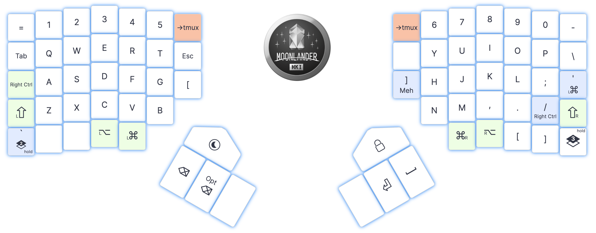
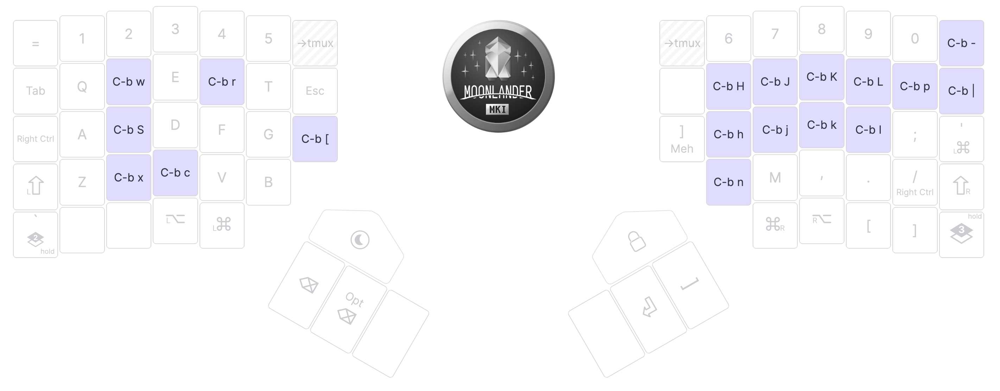
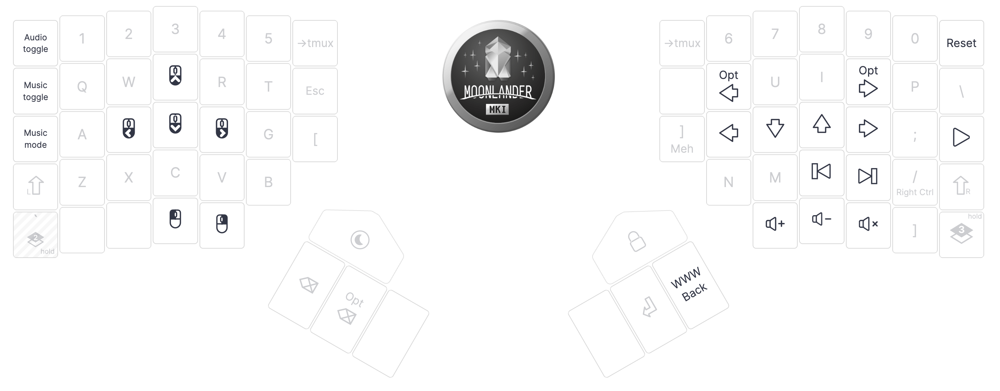
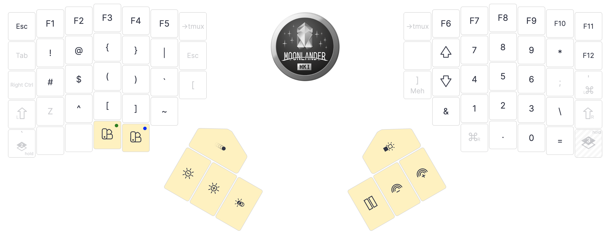

# Moonlander Layout

ZSA Moonlander MkI layout source, exported from Oryx.

**Edit in Oryx**: configure.zsa.io/moonlander/layouts/4wNDd/B4EeBW/0

## Files

| File | Purpose |
|------|---------|
| `keymap.json` | Oryx layout (source of truth — re-export from Oryx after changes) |
| `keymap.c` | Generated QMK C source |
| `config.h` | QMK config overrides |
| `rules.mk` | QMK build rules |

## Layers

### Layer 0 — Base



### Layer 1 — Tmux

Hold thumb key to activate. Each key sends `C-b` + the corresponding command.

**Left hand:**

| Key | Action |
|-----|--------|
| `w` | `C-b w` — window/session tree |
| `S` | `C-b S` — sync panes toggle |
| `x` | `C-b x` — kill pane |
| `c` | `C-b c` — new window |
| `[` | `C-b [` — copy mode |

**Right hand:**

| Key | Action |
|-----|--------|
| `h/j/k/l` | Navigate panes |
| `H/J/K/L` | Resize panes |
| `n/p` | Next/prev window |
| `\|` | Split horizontal |
| `-` | Split vertical |



### Layer 2 — Media / Mouse



### Layer 3 — Symbols / F-keys



## Updating

After changing the layout in Oryx, re-download the source zip and copy the
source files back into this directory:

```bash
cp ~/Downloads/zsa_moonlander_*_source/zsa_moonlander_*_source/{keymap.c,keymap.json,config.h,rules.mk} \
  ~/dotfiles/keyboards/moonlander/
```
